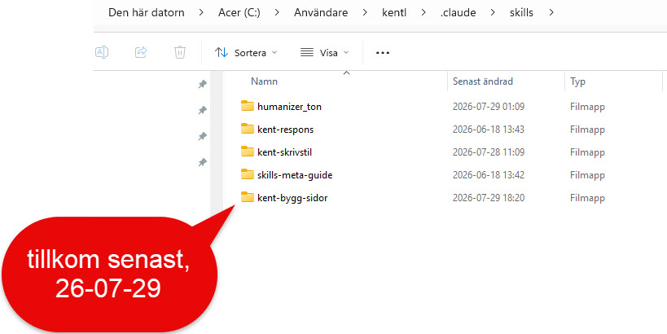
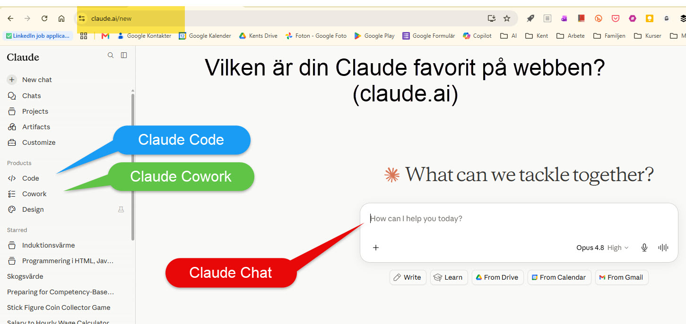
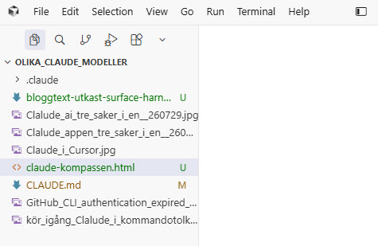
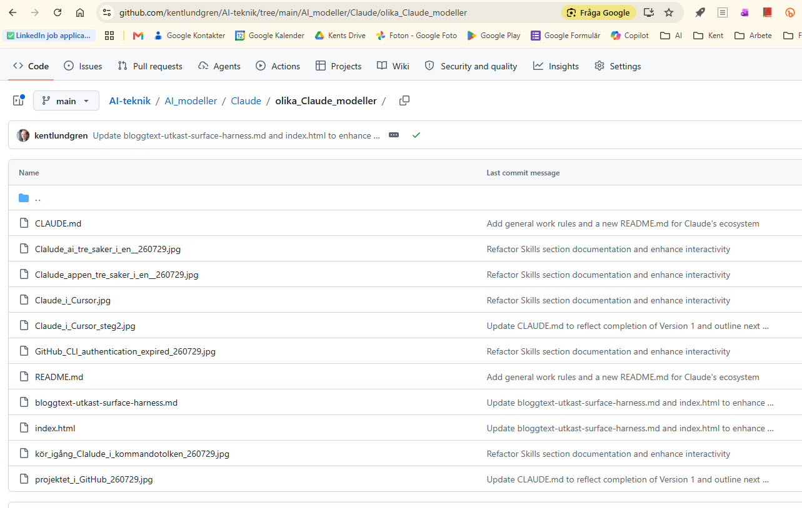

# En bild av Claudes ekosystem — inte facit, bara vad jag ser just nu

Jag satt med fem skärmdumpar i samma mapp en eftermiddag i juli, utan att veta vad de skulle bli. Nu vet jag: de blev ett verktyg. Det ligger live, och du kan klicka dig igenom det själv: [Claude-kompassen](https://kentlundgren.github.io/AI-teknik/AI_modeller/Claude/olika_Claude_modeller/). Den här texten är en genomgång av vad som faktiskt ligger där, i tre faser, och varför jag byggde det såhär tillsammans med Claude Code.

Jag vill vara tydlig med en sak innan jag börjar: det här är inte facit. Jag tror inte man kan tala om en absolut sanning när det gäller Claudes ekosystem — det ändrar sig för fort för det. Det här är en bild av hur det ser ut just nu, hos mig.

## Fas 1: filerna som styr, innan man ens börjar

*([Se Fas 1 i verktyget →](https://kentlundgren.github.io/AI-teknik/AI_modeller/Claude/olika_Claude_modeller/#fas1))*

Innan jag väljer var jag ska jobba har jag redan filer som formar hur Claude beter sig. Tre olika sorter, och jag trodde länge att en enda skulle räcka. Det gör den inte.

**CLAUDE.md** läser Claude Code vid varje session, oavsett vilken yta jag sitter i. **AGENTS.md** är en öppen standard som Cursor och en lång rad andra verktyg läser — men inte Claude Code. **SKILL.md** är ämnesspecifika instruktioner som triggas kontextuellt, snarare än alltid inlästa, och de finns på tre olika ställen samtidigt: projektnivå, global nivå på min dator, och kontoanknutet till mitt Claude-konto.

*Min egen `.claude\skills`-mapp, samma dag en ny skill (kent-bygg-sidor) tillkom.*

Det tredje stället blev ett konkret problem, inte bara en teoretisk risk. Skillen `kent-skrivstil` — den som formar just den här texten — visade sig ligga på **två** ställen samtidigt: globalt på datorn, och kontoanknutet, utan att vara synkade. Jag uppdaterade den ena för att lägga till en regel. Den andra fick ingen ändring alls. Det är precis den krocken jag menar när jag säger att flera nivåer är både en fördel och en nackdel — flexibiliteten att välja hur brett en regel ska gälla kostar överblick, särskilt när man, som jag, vill ha kontrollen själv istället för att lämna bort ägarskapet över sina egna skills helt.

## Fas 2: ytorna — samma motor, olika kartor

*([Se Fas 2 i verktyget →](https://kentlundgren.github.io/AI-teknik/AI_modeller/Claude/olika_Claude_modeller/#fas2))*

Nästa val är var jag faktiskt klickar. Anthropic har ett eget ord för det: **surface**. Claude Codes egen ordlista definierar det ordagrant som varje plats man når Claude Code från — CLI, VS Code, JetBrains, Desktop, claude.ai — och tillägger att alla ytor delar samma motor [(Anthropic, 2026a)](https://code.claude.com/docs/en/glossary).

*claude.ai: Chat, Code och Cowork nås härifrån, men Code och Cowork ligger under "Products" i menyn.*

*Samma namn som webben. Helt andra platser att hitta dem på.*

*Den mest ärliga ytan: ingen meny att gömma sig bakom, bara en fråga om förtroende innan något annat händer.*

*Samma harness, två gränssnitt, ett fönster — inte bara fyra olika appar, utan samma verktyg som dyker upp fler gånger än man tror.*

"Harness" är för övrigt inte ett ord jag skulle sätta på alla fyra bilderna ovan. Anthropic reserverar det specifikt för Claude Code: verktygen, kontexthanteringen och exekveringsmiljön som gör modellen till en kapabel agent [(Anthropic, 2026a)](https://code.claude.com/docs/en/glossary). Chatten i webbläsaren pratar. Claude Code kan röra filer och köra kommandon. Skillnaden mellan bild ett och bild fyra är inte bara utseende.

## Fas 3: Cursor, Git och vägen ut på webben

*([Se Fas 3 i verktyget →](https://kentlundgren.github.io/AI-teknik/AI_modeller/Claude/olika_Claude_modeller/#fas3))*

Den sista fasen handlar om vad som händer efter Claude, och här är jag inte objektiv, och tänker inte låtsas vara det.

*Här väljer jag Cursor. Jag ser alla filer i projektet, har kontroll på versionshanteringen, kan granska allt i en webbläsare.*

Jag väljer aktivt Cursor för det här — inte Claude Code. Claude Code känns i den här fasen helt värdelöst för mig när det gäller att hantera filer, versionshantering och överföring till webben. Det kan bero på att jag jobbat länge med Cursor och är van vid plattformen, inte på att Claude Code faktiskt saknar förmågan (jag har sett Claude Code köra samma git-kommandon lika bra från sin egen terminal). Men det är så jag upplever det, och det är upplevelsen som styr valet, inte en teknisk jämförelse.

Det är också i Cursor jag väljer **vad** som förs över till GitHub — hela mappen, eller bara en delmängd. Jag har själv skrivit om hur man gör det senare, med en orphan-gren och en pre-push-hook, i [Namnet 'main' betyder inte alltid main](https://klel.wordpress.com/2026/07/28/namnet-main-betyder-inte-alltid-main/) [(Lundgren, 2026c)](https://klel.wordpress.com/2026/07/28/namnet-main-betyder-inte-alltid-main/).

*Det som förs över blir en URL vem som helst kan öppna, via GitHub Pages — hela projektet, eller bara den delmängd jag valde.*

## En bild av, inte facit

Ingen av de tre faserna är fel, och ingen av dem är heller den enda vägen. Det här är hur jag har landat, just nu, efter en sommar av att gradvis hitta ord för saker jag tidigare bara kände på mig: att en yta inte är samma sak som en harness, att tre skills på tre ställen kan krocka utan att någon märker det förrän det är för sent, och att mitt eget val av Cursor säger mer om mig än om vad verktygen faktiskt klarar av.

Nästa gång ekosystemet ändrar sig — och det kommer det göra — vet jag i alla fall vad jag ska leta efter. Vill du se hela processen bakom den här texten och verktyget, inte bara resultatet, finns den i sidans eget [avsnitt om hur den blev till](https://kentlundgren.github.io/AI-teknik/AI_modeller/Claude/olika_Claude_modeller/#sammanfattning).

## Källförteckning

Anthropic (2026a) *Glossary – Claude Code Docs*. [Webbsida] Anthropic. Tillgänglig: https://code.claude.com/docs/en/glossary (hämtad 2026-07-29).

Lundgren, K. (2026a) *Claude Cowork, Cursor och Claude Code – tre verktyg, ett arbetsflöde*. [Blogginlägg] klel.wordpress.com. Tillgänglig: https://klel.wordpress.com/2026/06/01/claude-cowork-cursor-och-claude-code-tre-verktyg-ett-arbetsflode/ (hämtad 2026-07-29).

Lundgren, K. (2026b) *Tappade bort mig i Claudes ekosystem*. [Blogginlägg] klel.wordpress.com. Tillgänglig: https://klel.wordpress.com/2026/07/27/tappade-bort-mig-i-claudes-ekosystem/ (hämtad 2026-07-29).

Lundgren, K. (2026c) *Namnet 'main' betyder inte alltid main*. [Blogginlägg] klel.wordpress.com. Tillgänglig: https://klel.wordpress.com/2026/07/28/namnet-main-betyder-inte-alltid-main/ (hämtad 2026-07-29).

---
*Not till Kent (tas bort före publicering): bildreferenserna pekar på filnamnen i projektmappen — ladda upp dem i WordPress-editorn innan publicering.*
