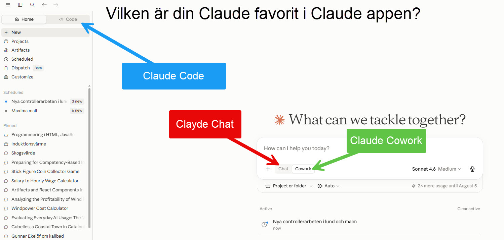
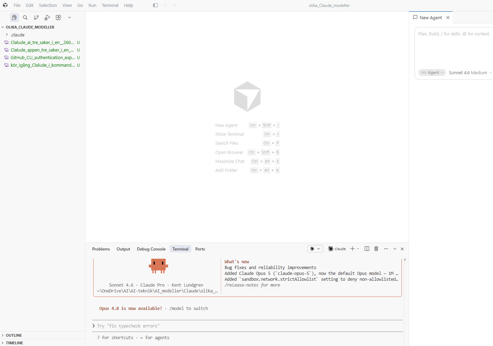
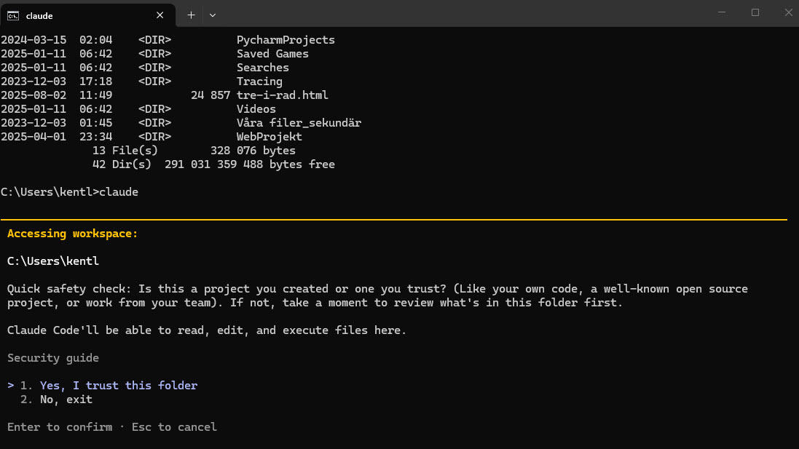
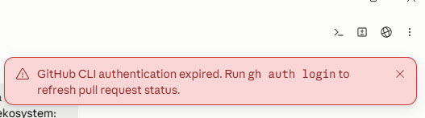

# Surface, harness och fem skärmdumpar — orden jag äntligen har för Claudes ekosystem

Klockan var någonstans runt två på eftermiddagen den 29 juli när jag tog den femte skärmdumpen på under en timme. Jag satt i samma mapp, på samma dator, och hade växlat mellan claude.ai i webbläsaren, Claude-appen på skrivbordet, en vanlig kommandotolk och till slut Cursor. I varje steg dök samma tre bokstäver upp: Claude. Fast aldrig riktigt på samma sätt. Sen kom varningen: GitHub CLI-autentiseringen hade gått ut. Jag stängde locket för en stund och tänkte: jag har fortfarande inte riktiga ord för det jag just gjorde.

Det visade sig att Anthropic redan hade orden. Jag hade bara inte läst rätt sida.

## Tre ytor, samma motor

Jag har tidigare skrivit om hur jag [tappade bort mig i Claudes ekosystem](https://klel.wordpress.com/2026/07/27/tappade-bort-mig-i-claudes-ekosystem/) [(Lundgren, 2026b)](https://klel.wordpress.com/2026/07/27/tappade-bort-mig-i-claudes-ekosystem/) — tre produkter, liknande gränssnitt, olika kartor. Den här gången tog jag skärmdumpar istället för att bara bli irriterad.

*claude.ai i webbläsaren: Chat, Code och Cowork nås alla härifrån, men Code och Cowork ligger under "Products" i vänstermenyn medan Chat är själva huvudvyn.*

*Samma tre saker i skrivbordsappen — men nu är Code en egen flik uppe till vänster, och Chat/Cowork växlas med knappar vid inmatningsfältet. Samma namn, olika kartor.*

Det korrekta ordet för de här platserna, visar det sig, är **surface**. Claude Codes egen ordlista definierar det ordagrant: *"Any place you access Claude Code: the CLI, VS Code, JetBrains, Desktop, or claude.ai. All surfaces share the same engine"* [(Anthropic, 2026a)](https://code.claude.com/docs/en/glossary). Alla ytor delar samma motor. Det är precis vad bild ett och två visar — samma motor, två olika kartor över var man klickar.

## En fjärde yta, gömd inuti en tredje app

Det jag inte hade räknat med var att samma verktyg kan dyka upp **två gånger i samma fönster**.

*Cursor öppen i samma projektmapp. Till höger: en agentpanel märkt "Sonnet 4.6 Medium" med platshållartext "Plan, Build, / for skills, @ for context". Nertill: Claude Code CLI i den inbyggda terminalen, med sessionsraden "Sonnet 4.6 · Claude Pro · Kent Lundgren".*

Jag är inte hundra procent säker på om sidopanelen tekniskt sett är Claude Code-tillägget för Cursor eller något annat — men vokabuläret ("Plan"/"Build"-lägen, `/skills`, `@`-kontext) är precis Claude Codes eget språk, inte generisk editor-jargong. Mest sannolikt är det alltså **samma harness, i två gränssnitt, i samma fönster.** Det är en mer konkret bild av förvirringen än "tre olika appar" — det är samma verktyg som gömmer sig på fler ställen än man tror.

## Och en femte yta, utan grafiskt gränssnitt alls

*`claude` körd direkt i Windows kommandotolk. Ingen meny, ingen flik — bara en fråga: "Is this a project you trust?"*

Den här ytan har ingen layout att lära sig, för att det knappt finns någon layout. Det är samtidigt den mest ärliga av de fem bilderna: en fråga om förtroende, innan något annat händer.

## Vad är då en "harness"?

Jag frågade mig själv om "harness" var rätt ord för alla fem ytorna. Det är det inte. Anthropic reserverar ordet specifikt för Claude Code: *"The tools, context management, and execution environment that turn a language model into a capable coding agent. Claude Code is the harness; Claude is the model inside it"* [(Anthropic, 2026a)](https://code.claude.com/docs/en/glossary). Chatten i webbläsaren är inte en harness i den meningen — den pratar, men kan inte röra filer eller köra kommandon på egen hand. Claude Code kan. Skillnaden mellan bild ett och bild tre är alltså inte bara utseende, det är vad verktyget faktiskt får lov att göra.

## Modellagret ovanpå allt

Terminalen i Cursor-bilden visar något jag inte planerat att skriva om, men som är för bra för att hoppa över. Samma eftermiddag, i en enda skärmdump, syns tre olika modellbeteckningar: sidopanelen visar "Sonnet 4.6", terminalens "What's new"-logg meddelar "Added Claude Opus 5 ... now the default Opus model" och "Opus 4.8 is now available!". Tre namn, en dag. Jag gissar inte på vilket som är "rätt" — jag konstaterar bara att namnen rör sig snabbare än jag hinner lära mig dem, och att det är en del av varför man tappar bort sig. Ytan ändras inte. Motorn under den gör det, hela tiden.

## Och så gick GitHub-inloggningen ut

*Meddelandet som fick mig att stanna upp: "GitHub CLI authentication expired. Run gh auth login to refresh pull request status."*

Jag antog att det var samma inloggning som git redan använde. Det var det inte. Jag körde `gh auth status` i samma mapp och fick svaret: kontot var **inte inloggat alls**, inte bara utgånget. Samtidigt fungerade vanlig `git`-push/pull utmärkt mot mitt repo på GitHub. Det är alltså tre separata lager: git själv, GitHub som fjärrplats, och `gh` som ett tredje, fristående autentiseringslager Claude Code använder för att visa PR-status. Tre lager, tre möjliga felkällor, och jag hade bara koll på ett av dem.

Det påminner om något jag redan lärt mig den hårda vägen: att [Git och GitHub inte är samma sak](https://klel.wordpress.com/2026/07/28/namnet-main-betyder-inte-alltid-main/) [(Lundgren, 2026c)](https://klel.wordpress.com/2026/07/28/namnet-main-betyder-inte-alltid-main/), även om jag sagt "Git" och menat "GitHub" i flera år. Nu vet jag att man kan lägga till ett tredje namn på listan: `gh`.

## Cursor, Claude Code och vem som "äger" git

Jag har länge upplevt att Cursor samarbetar bättre med git än Claude Code gör — lättare att se en diff, lättare att committa. Men när jag faktiskt körde `git status` och `git remote -v` direkt i Claude Codes terminal fungerade det precis lika bra. Skillnaden är inte förmåga. Skillnaden är att Cursor visar det visuellt och Claude Code visar det som text. Frågan är alltså vilket gränssnitt jag litar mest på för tillfället — inte vilket verktyg som "kan" git, för de kan båda.

Det ligger nära slutsatsen i mitt förra tekniska inlägg: en regel man ska komma ihåg är svagare än ett skydd som stoppar en [(Lundgren, 2026c)](https://klel.wordpress.com/2026/07/28/namnet-main-betyder-inte-alltid-main/). Vilket verktyg jag råkar klicka i den dagen spelar mindre roll än att skyddet — hooken, spärren, regeln — faktiskt sitter i repot och inte bara i mitt huvud.

## Filerna som styr — CLAUDE.md, AGENTS.md, SKILL.md

Det sista lagret handlar inte om var jag pratar med AI:n, utan om hur jag i förväg formar vad den gör. Jag har på senare tid börjat luta mig allt mer på tre typer av styrfiler: **CLAUDE.md**, som Claude Code läser vid varje session; **SKILL.md**, ämnesspecifika instruktioner som triggas när de behövs (den här texten skrevs faktiskt med hjälp av en sådan skill); och **AGENTS.md**, en öppen standard som stöds av en lång rad andra verktyg.

Här trodde jag länge att en enda fil skulle räcka för allt. Det gör den inte. Claude Codes egen ordlista nämner AGENTS.md ingenstans [(Anthropic, 2026a)](https://code.claude.com/docs/en/glossary), och den officiella AGENTS.md-sidan listar en lång rad verktyg — Cursor bland dem — utan att nämna Claude en enda gång [(agents.md, 2026)](https://agents.md/). Slutsatsen är enkel men lite tråkig: vill jag styra både Claude Code och Cursor med samma regler räcker det inte med en fil. Jag behöver båda. Det är en detalj jag tänker gräva djupare i ett senare inlägg — den här gången nöjer jag mig med att konstatera den.

## Fem bilder, en eftermiddag, orden jag saknade

Ingen av de fem ytorna är fel. Det var aldrig problemet. Problemet var att jag inte hade ord för skillnaden mellan en yta jag klickar på och en harness som faktiskt gör saker åt mig, eller för att tre olika modellnamn kan synas samtidigt i en enda skärmdump utan att något är trasigt. Nu har jag orden. Nästa gång jag tappar bort mig vet jag i alla fall vad jag letar efter.

Jag har byggt en liten interaktiv karta av det här — samma fem bilder, samma lager, fast klickbart. Den ligger nu live, på webben, tillgänglig för vem som helst som vill klicka runt själv: [Claude-kompassen](https://kentlundgren.github.io/AI-teknik/AI_modeller/Claude/olika_Claude_modeller/). Sidan har till och med ett eget lager som visar hur den blev till — samma process som den här texten.

## Källförteckning

Anthropic (2026a) *Glossary – Claude Code Docs*. [Webbsida] Anthropic. Tillgänglig: https://code.claude.com/docs/en/glossary (hämtad 2026-07-29).

Anthropic (2026b) *The Claude Cowork product guide*. [Blogginlägg] Anthropic. Tillgänglig: https://claude.com/blog/the-claude-cowork-product-guide (hämtad 2026-07-29).

agents.md (2026) *AGENTS.md — open format for guiding coding agents*. [Webbsida]. Tillgänglig: https://agents.md/ (hämtad 2026-07-29).

Lundgren, K. (2026a) *Claude Cowork, Cursor och Claude Code – tre verktyg, ett arbetsflöde*. [Blogginlägg] klel.wordpress.com. Tillgänglig: https://klel.wordpress.com/2026/06/01/claude-cowork-cursor-och-claude-code-tre-verktyg-ett-arbetsflode/ (hämtad 2026-07-29).

Lundgren, K. (2026b) *Tappade bort mig i Claudes ekosystem*. [Blogginlägg] klel.wordpress.com. Tillgänglig: https://klel.wordpress.com/2026/07/27/tappade-bort-mig-i-claudes-ekosystem/ (hämtad 2026-07-29).

Lundgren, K. (2026c) *Namnet 'main' betyder inte alltid main*. [Blogginlägg] klel.wordpress.com. Tillgänglig: https://klel.wordpress.com/2026/07/28/namnet-main-betyder-inte-alltid-main/ (hämtad 2026-07-29).

---
*Not till Kent (tas bort före publicering): bildreferenserna ovan pekar på filnamnen i projektmappen — de behöver laddas upp i WordPress-editorn på vanligt sätt innan publicering.*
