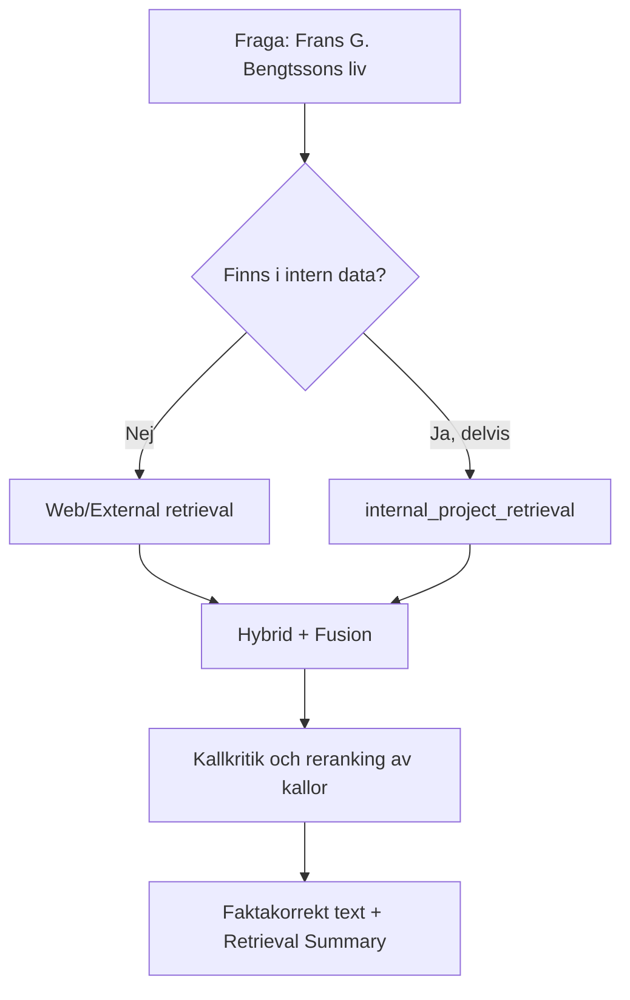

# RAG-metod: Så bygger vi en faktakorrekt sida om Frans G. Bengtsson

> **Steg 1 av 2 – Konceptuell teori.**
> Denna fil beskriver *hur* vi tänker använda RAG-ramverket (reglerna i
> [`../agents.md`](../agents.md) och verktygen i [`../skills.md`](../skills.md)) för att bygga en
> faktakorrekt biografisida om Frans G. Bengtsson. I detta steg görs **ingen** verklig
> web-retrieval och **inga** overifierade sakpåståenden skrivs. Steg 2 utför den verkliga
> sökningen och fyller i fakta med riktiga källor.

Syftet är dubbelt (precis som hela projektet): dels ska vi förstå **teorin** bakom RAG,
dels ska teorin sedan omsättas i **praktik**. Den här filen är "bakom kulisserna" –
den visar tankearbetet innan en enda faktamening skrivs på själva sidan.

---

## 1. Problemformulering

**Mål:** En levande, fyllig och faktakorrekt sida om Frans G. Bengtssons liv.

**Utmaning:** Faktakorrekthet. En biografi kräver korrekta årtal, verk, händelser och
sammanhang. Vi får inte hitta på (hallucinera). Därför använder vi RAG-tekniker för att
*hämta* och *verifiera* information istället för att förlita oss på minnet.

---

## 2. Vilken retrieval-nivå? (koppling till `agents.md`)

Enligt beslutslogiken i [`../agents.md`](../agents.md) ska vi först förstå frågan och sedan välja
retrieval-nivå.

- **Finns svaret i intern projekt-data?** Nej. Projektet innehåller RAG-dokumentation,
  inte biografiskt material om Frans G. Bengtsson. Intern retrieval ger alltså lite här.
- **Är frågan enkel eller komplex?** En biografi är en **komplex, sammansatt** fråga
  (många fakta som ska stämma och hänga ihop).
- **Slutsats enligt policyn:** Svaret ligger *utanför* projektets data → använd
  **Web/External retrieval + fusion**. Eftersom hög precision krävs motiverar detta
  **Advanced RAG**-läge snarare än Classic.

Detta följer direkt agentens regel: *"Börja alltid med att överväga Advanced RAG"* och
*"prioritera intern projekt-data, använd web som komplement/fallback"*. Här är web inte
bara komplement utan den **primära** källan, eftersom intern data saknas – och det ska
redovisas öppet i vår Retrieval Summary.

---

## 3. Vilka skills använder vi? (koppling till `skills.md`)

Genomgång av de fyra skills i [`../skills.md`](../skills.md) och hur var och en tillämpas i detta fall.

### `internal_project_retrieval`
- **Roll här:** Begränsad. Det finns ingen intern kunskapsbas om Frans G. Bengtsson.
- **Slutsats:** Vi noterar öppet att intern retrieval inte bidrar, vilket är ett exempel
  på transparenskravet i `agents.md`.

### `web_external_retrieval` (primär skill i detta fall)
- **Roll här:** Den viktigaste skillen. Vi söker upp tillförlitliga källor om författaren.
- **Konceptuellt tillvägagångssätt i steg 2:**
  1. Sökfrågor kring liv, verk, årtal, eftermäle.
  2. Hämta topp-resultat (titel, länk, snippet).
  3. Vid behov hämta fullständigt innehåll från de mest tillförlitliga sidorna.
- **Begränsning:** Web-data är live och kan variera i kvalitet – därför krävs källkritik.

### `hybrid_retrieval_and_fusion` (Advanced RAG)
- **Roll här:** Kombinerar flera webbkällor och (i mån av intern data) intern retrieval,
  och gör **context fusion**.
- **Varför:** En enda källa räcker inte för en trovärdig biografi. Flera källor jämförs,
  motsägelser löses och ett sammanhängande svar syntetiseras – med bibehållna källhänvisningar.
- **Fusion-strategi:** `llm_synthesis` (standard enligt `skills.md`), dvs. modellen väger
  samman källorna till en sammanhållen text utan motsägelser.

### `explain_rag_technique` (pedagogisk)
- **Roll här:** Används för att motivera *varför* vi valde web + fusion, och för att
  förklara teknikerna för läsaren. Denna metod-fil är i praktiken ett resultat av denna skill.

---

## 4. Källkritik som "reranking" och "relevance filtering"

I `skills.md` beskrivs reranking och relevance filtering som steg som omvärderar och
filtrerar hämtat material. Applicerat på en biografi blir detta **källkritik**:

Vi rangordnar (konceptuellt) källor efter tillförlitlighet, ungefär så här:

| Prioritet | Typ av källa | Motivering |
|-----------|--------------|------------|
| 1 (högst) | Uppslagsverk och akademiska referensverk (t.ex. nationalencyklopedier, litteraturhistoriska verk) | Redaktionellt granskade, hög tillförlitlighet |
| 2 | Biografier och etablerade litteraturvetenskapliga texter | Djup och kontext, men kan ha tolkningar |
| 3 | Väletablerade allmänna uppslagssidor | Bra överblick, verifiera mot prioritet 1-2 |
| 4 (lägst) | Bloggar, forum, ej granskat material | Endast som uppslag, aldrig som enda källa |

**Relevance filtering:** Fakta som bara stöds av lågt rankade källor och inte kan bekräftas
av högre rankade källor markeras som osäkra eller utelämnas.

### Referensformat: Harvard (enligt WORKFLOW.md, Regel 3)

Alla källor som läggs in i steg 2 ska anges i **Harvardformat** med **kontrollerade länkar**:

- **In-text:** (Författare, år), t.ex. (Nationalencyklopedin, 2024).
- **Referenslista:** *Efternamn, Förnamnsinitial. (år). Titel. Utgivare/Webbplats. URL (hämtad ÅÅÅÅ-MM-DD).*
- Varje länk **kontrolleras** så att den både **fungerar** och är **relevant** innan den skrivs in.

Exempel på hur en färdig referens kan se ut (fylls med verkliga uppgifter i steg 2):

> Nationalencyklopedin. (2024). *Frans G. Bengtsson*. NE.se. https://www.ne.se/... (hämtad 2026-07-15).

---

## 5. Transparenskrav: Retrieval Summary (mall att fylla i steg 2)

Enligt `agents.md` ska varje svar innehålla en Retrieval Summary. Nedan är mallen som
fylls i när den verkliga retrievalen är gjord i steg 2.

> **Retrieval Summary (fylls i steg 2)**
> - **Teknik:** Advanced RAG (web/external + fusion)
> - **Interna källor:** [antal / "inga relevanta"]
> - **Externa källor:** [antal + vilka]
> - **Reranking/källkritik:** [ja/nej + hur källor prioriterades]
> - **Fusion:** [ja/nej + strategi]
> - **Varför denna teknik:** [motivering]
> - **Begränsningar/osäkerheter:** [motsägelser mellan källor, luckor]

---

## 6. Checklista för steg 2 (fakta som ska verifieras)

Följande uppgifter ska hämtas och verifieras mot minst en högt rankad källa innan de
skrivs in på sidan. (Alla fält lämnas medvetet tomma nu – de fylls i steg 2.)

- [ ] Födelseår och födelseort
- [ ] Dödsår och dödsort
- [ ] Uppväxt och familjebakgrund
- [ ] Utbildning
- [ ] Genombrott och viktigaste verk (t.ex. romanen *Röde Orm*)
- [ ] Essäistik och poesi
- [ ] Stil och teman i författarskapet
- [ ] Eftermäle och betydelse i svensk litteratur
- [ ] Källförteckning i Harvardformat med kontrollerade, fungerande och relevanta länkar

---

## 7. Så hänger filerna ihop

- [`../agents.md`](../agents.md) – **varför/när**: beslutslogiken som säger att vi ska använda web + fusion.
- [`../skills.md`](../skills.md) – **hur/med vad**: de konkreta verktygen (web_external_retrieval, hybrid_retrieval_and_fusion m.fl.).
- Denna fil (`RAG-metod.md`) – **tillämpningen**: hur ovanstående används på just Frans G. Bengtsson.
- [`index.html`](./index.html) – **resultatet**: själva sidan (i steg 1 ett skelett med platshållare).

---

*Steg 1 (teori) klar. Nästa steg: verklig web-retrieval, källkritik, fusion och ifyllnad av fakta + Retrieval Summary.*
