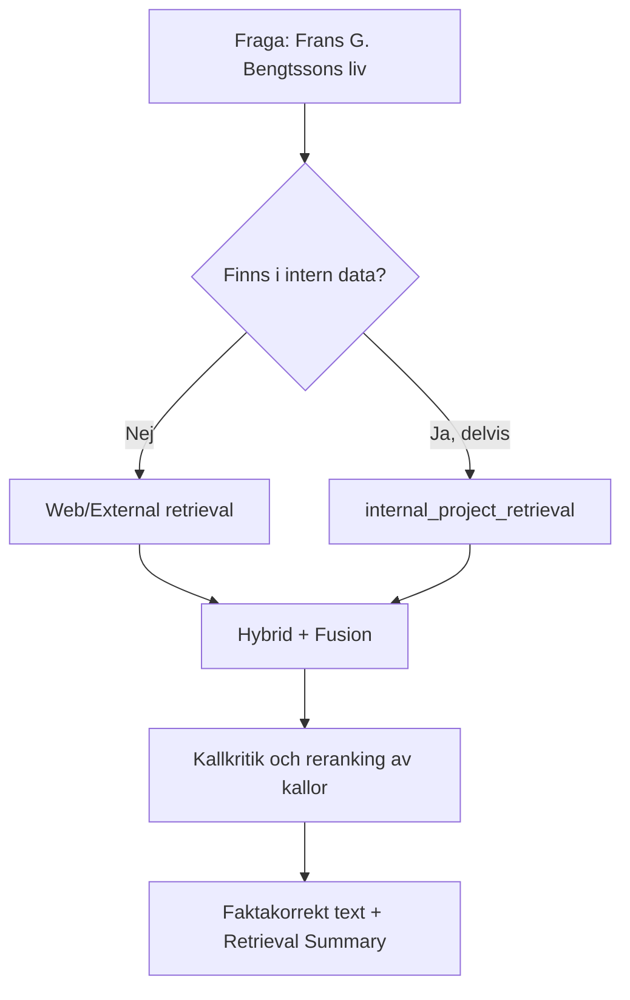

# RAG-metod: Så bygger vi en faktakorrekt sida om Frans G. Bengtsson

> **Steg 1 (teori) OCH steg 2 (praktik) – båda klara.**
> Denna fil beskriver *hur* vi använder RAG-ramverket (reglerna i
> [`../agents.md`](../agents.md) och verktygen i [`../skills.md`](../skills.md)) för att bygga en
> faktakorrekt biografisida om Frans G. Bengtsson.
> Steg 1 beskrev teorin. **Steg 2 är nu utfört:** verklig web-retrieval har gjorts, fakta har
> verifierats mot flera källor, och sidan [`index.html`](./index.html) är ifylld med källbelagd
> text samt en Retrieval Summary (se avsnitt 5 nedan, som nu är ifyllt).

Syftet är dubbelt (precis som hela projektet): dels ska vi förstå **teorin** bakom RAG,
dels ska teorin sedan omsättas i **praktik**. Den här filen är "bakom kulisserna" –
den visar tankearbetet innan en enda faktamening skrivs på själva sidan.

---

## 1. Problemformulering

**Mål:** En levande, fyllig och faktakorrekt sida om Frans G. Bengtssons liv.

**Utmaning:** Faktakorrekthet. En biografi kräver korrekta årtal, verk, händelser och
sammanhang. Vi får inte hitta på (hallucinera). Därför använder vi RAG-tekniker för att
*hämta* och *verifiera* information istället för att förlita oss på minnet.

---

## 2. Vilken retrieval-nivå? (koppling till `agents.md`)

Enligt beslutslogiken i [`../agents.md`](../agents.md) ska vi först förstå frågan och sedan välja
retrieval-nivå.

- **Finns svaret i intern projekt-data?** Nej. Projektet innehåller RAG-dokumentation,
  inte biografiskt material om Frans G. Bengtsson. Intern retrieval ger alltså lite här.
- **Är frågan enkel eller komplex?** En biografi är en **komplex, sammansatt** fråga
  (många fakta som ska stämma och hänga ihop).
- **Slutsats enligt policyn:** Svaret ligger *utanför* projektets data → använd
  **Web/External retrieval + fusion**. Eftersom hög precision krävs motiverar detta
  **Advanced RAG**-läge snarare än Classic.

Detta följer direkt agentens regel: *"Börja alltid med att överväga Advanced RAG"* och
*"prioritera intern projekt-data, använd web som komplement/fallback"*. Här är web inte
bara komplement utan den **primära** källan, eftersom intern data saknas – och det ska
redovisas öppet i vår Retrieval Summary.

---

## 3. Vilka skills använder vi? (koppling till `skills.md`)

Genomgång av de fyra skills i [`../skills.md`](../skills.md) och hur var och en tillämpas i detta fall.

### `internal_project_retrieval`
- **Roll här:** Begränsad. Det finns ingen intern kunskapsbas om Frans G. Bengtsson.
- **Slutsats:** Vi noterar öppet att intern retrieval inte bidrar, vilket är ett exempel
  på transparenskravet i `agents.md`.

### `web_external_retrieval` (primär skill i detta fall)
- **Roll här:** Den viktigaste skillen. Vi söker upp tillförlitliga källor om författaren.
- **Konceptuellt tillvägagångssätt i steg 2:**
  1. Sökfrågor kring liv, verk, årtal, eftermäle.
  2. Hämta topp-resultat (titel, länk, snippet).
  3. Vid behov hämta fullständigt innehåll från de mest tillförlitliga sidorna.
- **Begränsning:** Web-data är live och kan variera i kvalitet – därför krävs källkritik.

### `hybrid_retrieval_and_fusion` (Advanced RAG)
- **Roll här:** Kombinerar flera webbkällor och (i mån av intern data) intern retrieval,
  och gör **context fusion**.
- **Varför:** En enda källa räcker inte för en trovärdig biografi. Flera källor jämförs,
  motsägelser löses och ett sammanhängande svar syntetiseras – med bibehållna källhänvisningar.
- **Fusion-strategi:** `llm_synthesis` (standard enligt `skills.md`), dvs. modellen väger
  samman källorna till en sammanhållen text utan motsägelser.

### `explain_rag_technique` (pedagogisk)
- **Roll här:** Används för att motivera *varför* vi valde web + fusion, och för att
  förklara teknikerna för läsaren. Denna metod-fil är i praktiken ett resultat av denna skill.

---

## 4. Källkritik som "reranking" och "relevance filtering"

I `skills.md` beskrivs reranking och relevance filtering som steg som omvärderar och
filtrerar hämtat material. Applicerat på en biografi blir detta **källkritik**:

Vi rangordnar (konceptuellt) källor efter tillförlitlighet, ungefär så här:

| Prioritet | Typ av källa | Motivering |
|-----------|--------------|------------|
| 1 (högst) | Uppslagsverk och akademiska referensverk (t.ex. nationalencyklopedier, litteraturhistoriska verk) | Redaktionellt granskade, hög tillförlitlighet |
| 2 | Biografier och etablerade litteraturvetenskapliga texter | Djup och kontext, men kan ha tolkningar |
| 3 | Väletablerade allmänna uppslagssidor | Bra överblick, verifiera mot prioritet 1-2 |
| 4 (lägst) | Bloggar, forum, ej granskat material | Endast som uppslag, aldrig som enda källa |

**Relevance filtering:** Fakta som bara stöds av lågt rankade källor och inte kan bekräftas
av högre rankade källor markeras som osäkra eller utelämnas.

### Referensformat: Harvard (enligt WORKFLOW.md, Regel 3)

Alla källor som läggs in i steg 2 ska anges i **Harvardformat** med **kontrollerade länkar**:

- **In-text:** (Författare, år), t.ex. (Nationalencyklopedin, 2024).
- **Referenslista:** *Efternamn, Förnamnsinitial. (år). Titel. Utgivare/Webbplats. URL (hämtad ÅÅÅÅ-MM-DD).*
- Varje länk **kontrolleras** så att den både **fungerar** och är **relevant** innan den skrivs in.

Exempel på hur en färdig referens kan se ut (fylls med verkliga uppgifter i steg 2):

> Nationalencyklopedin. (2024). *Frans G. Bengtsson*. NE.se. https://www.ne.se/... (hämtad 2026-07-15).

---

## 5. Transparenskrav: Retrieval Summary (mall att fylla i steg 2)

Enligt `agents.md` ska varje svar innehålla en Retrieval Summary. Nedan är den **ifyllda**
sammanfattningen från steg 2 (samma redovisas även på själva sidan).

> **Retrieval Summary (steg 2 – utförd 2026-07-15)**
> - **Teknik:** Advanced RAG (web/external retrieval + context fusion).
> - **Interna källor:** inga relevanta (ingen intern data om författaren fanns i projektet).
> - **Externa källor:** 4 st –
>   1. Svenska Wikipedia – https://sv.wikipedia.org/wiki/Frans_G._Bengtsson
>   2. English Wikipedia – https://en.wikipedia.org/wiki/Frans_G._Bengtsson
>   3. Norstedts förlag – https://www.norstedts.se/116457-frans-g-bengtsson
>   4. Frans G. Bengtsson-sällskapet (Minnesbiblioteket) – http://gullspang.fgb-sallskapet.org/om-frans-g-bengtsson/
> - **Reranking/källkritik:** ja – uppslagsverk och förlags-/sällskapskällor prioriterades,
>   och fakta korsverifierades mot minst två källor där det gick.
> - **Fusion:** ja – `llm_synthesis`; uppgifter från flera källor vägdes samman till en
>   sammanhängande text med bibehållna källhänvisningar.
> - **Länkkontroll:** alla fyra länkar kontrollerades (fungerar + relevanta) enligt
>   WORKFLOW.md, Regel 3.
> - **Varför denna teknik:** biografisk fakta saknas i intern data → web krävs; hög
>   faktakrav → Advanced RAG med fusion och källkritik.
> - **Begränsningar/osäkerheter:** exakt födelseplats (Rössjöholm/Ramnekulla) och årtal för
>   licentiatexamen (1930 vs 1931) skiljer sig mellan källorna och redovisas öppet på sidan.

---

## 6. Checklista för steg 2 (fakta som ska verifieras)

Följande uppgifter hämtades och verifierades i steg 2 mot minst en högt rankad källa
(kryssade rutor = klart).

- [x] Födelseår och födelseort (4 oktober 1894, Tåssjö socken, Skåne – med källkritisk not)
- [x] Dödsår och dödsort (19 december 1954, Ribbingsfors, Amnehärad)
- [x] Uppväxt och familjebakgrund (far förvaltare på Rössjöholm)
- [x] Utbildning (studentexamen 1912, fil.kand. 1920, fil.lic. ca 1930/1931)
- [x] Genombrott och viktigaste verk (*Röde Orm* 1941/1945, *Karl XII:s levnad* 1935–1936)
- [x] Essäistik och poesi (*Tärningkast* 1923, *Litteratörer och militärer* 1929 m.fl.)
- [x] Stil och teman i författarskapet (lärdom, humor, historiska motiv)
- [x] Eftermäle och betydelse i svensk litteratur (3:e plats i Röda rummet 1998)
- [x] Källförteckning i Harvardformat med kontrollerade, fungerande och relevanta länkar

---

## 7. Så hänger filerna ihop

- [`../agents.md`](../agents.md) – **varför/när**: beslutslogiken som säger att vi ska använda web + fusion.
- [`../skills.md`](../skills.md) – **hur/med vad**: de konkreta verktygen (web_external_retrieval, hybrid_retrieval_and_fusion m.fl.).
- Denna fil (`RAG-metod.md`) – **tillämpningen**: hur ovanstående används på just Frans G. Bengtsson.
- [`index.html`](./index.html) – **resultatet**: själva sidan (i steg 1 ett skelett med platshållare).

---

*Steg 1 (teori) och steg 2 (praktik) är klara. Sidan är byggd med Advanced RAG: web-retrieval,
källkritik, fusion och källbelagd text med Retrieval Summary. Jämför gärna Classic- och
Advanced-versionen på [`index.html`](./index.html).*
