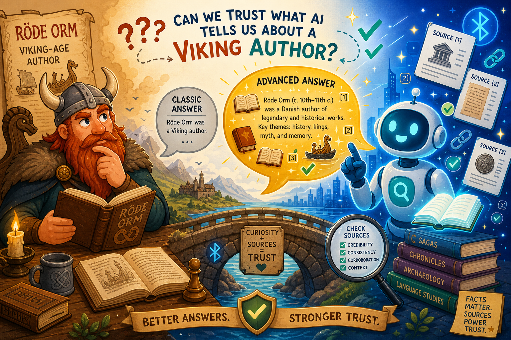

# RAG – Classic & Advanced Retrieval-Augmented Generation

En pedagogisk och praktisk fördjupning i **RAG (Retrieval-Augmented Generation)**. Målet är att kunna **förstå och styra** både klassisk RAG och avancerad RAG – teoretiskt *och* praktiskt – och att skapa dokument som är portabla mellan olika AI-verktyg (Claude, Cursor, LangChain, LlamaIndex, Haystack, Grok m.fl.).

> **Live-sida:** En interaktiv översikt av denna mapp finns publicerad via GitHub Pages:
> **https://kentlundgren.github.io/AI-teknik/RAG/**

---

## Vad handlar detta om?

RAG är tekniken att **hämta relevant information** (retrieval) och låta en språkmodell **generera svar** baserat på den hämtade informationen istället för att enbart förlita sig på modellens inbyggda kunskap. Det ger mer korrekta, uppdaterade och källförankrade svar – och minskar risken för hallucinationer.

Den här delen av projektet fokuserar på att göra RAG:

- **Transparent** – agenten förklarar alltid vilken teknik den använde och varför.
- **Kontrollerbar** – tydliga beslutsregler för när Classic RAG respektive Advanced RAG ska användas.
- **Pedagogisk** – dokumenten fungerar både som styrdokument och som läromedel.

---

## Vad har vi skapat hittills?

Två centrala filer som hänger ihop:

### 1. [`agents.md`](./agents.md) – Styrdokument (agentens beteende)
Definierar en transparent och pedagogisk RAG-agent med tydlig beslutslogik:

- **Retrieval Policy** – beslutsregler i prioritetsordning (förstå frågan → välj nivå → prioritera källor → avancerad retrieval → transparens).
- **Prioritering av källor** – intern projekt-data först, web/externa källor endast som komplement.
- **Krav på Retrieval Summary** – varje svar redovisar vilken teknik som användes, hur många chunks som hämtades, om reranking/fusion användes och varför.
- **Advanced RAG-tekniker** – hybrid retrieval, metadata filtering, reranking, relevance filtering och context fusion.

### 2. [`skills.md`](./skills.md) – Konkreta skills (agentens verktyg)
Innehåller väldokumenterade, portabla skills:

| Skill | Syfte |
|-------|-------|
| `internal_project_retrieval` | Hämtar information från projektets egna filer. Stödjer både Classic och Advanced Mode. |
| `web_external_retrieval` | Hämtar aktuell information från webben (Web RAG / Search-Augmented Generation). |
| `hybrid_retrieval_and_fusion` | Kombinerar intern + web-retrieval och gör intelligent context fusion (Advanced RAG). |
| `explain_rag_technique` | Rent pedagogisk skill som förklarar RAG-koncept och val av teknik. |

**Hur de samverkar:** `agents.md` styr *när* och *varför* en viss teknik ska användas, medan `skills.md` beskriver de konkreta verktygen agenten *anropar*.

---

## Praktiskt exempel: Frans G. Bengtsson-projektet

För att visa RAG **både teoretiskt och praktiskt** bygger vi ett skarpt exempel: en sida om
författaren **Frans G. Bengtssons** liv. Poängen är att demonstrera hur man använder **"vanlig"
(Classic) RAG** och **Advanced RAG** för att skapa en **bättre, mer faktakorrekt** sida än vad
man får om man bara låter en språkmodell skriva ur minnet.

Exemplet ligger i mappen [`Frans-G-Bengtsson/`](./Frans-G-Bengtsson/) och görs i **två steg**:

1. **Teori (steg 1 – klart):** Filen [`RAG-metod.md`](./Frans-G-Bengtsson/RAG-metod.md) beskriver
   "bakom kulisserna" hur beslutslogiken i `agents.md` och verktygen i `skills.md` tillämpas för
   att säkra faktakorrekthet – vilken retrieval-nivå som väljs och varför, källkritik som
   reranking, samt en Retrieval Summary.
2. **Praktik (steg 2 – klart):** Verklig web-retrieval har utförts, fakta har verifierats mot
   flera källor och fyllts i, och källorna anges i Harvardformat med kontrollerade länkar. Sidan
   visar dessutom en Classic-version och en Advanced-version sida vid sida.

> **Live-sida:** https://kentlundgren.github.io/AI-teknik/RAG/Frans-G-Bengtsson/
>
> **Blogginlägg om projektet:** [*"Kan man lita på det AI:n berättar om Frans G. Bengtsson?"*](https://klel.wordpress.com/2026/07/15/kan-man-lita-pa-det-ain-berattar-om-frans-g-bengtsson/)



Så här hänger teori och praktik ihop i exemplet:

| Steg | Vad | Fil |
|------|-----|-----|
| 1 | Teori/metod – hur RAG *ska* användas | [`RAG-metod.md`](./Frans-G-Bengtsson/RAG-metod.md) |
| 2 | Praktik – färdig, källbelagd sida (Classic vs Advanced) | [`index.html`](./Frans-G-Bengtsson/index.html) |

---

## Skillnaden mellan Classic RAG och Advanced RAG

### Classic RAG – den enkla pipelinen

```
Fråga → Query Embedding → Similarity Search → Top-K chunks → LLM → Svar
```

Frågan görs om till en vektor (embedding), man söker efter de mest lika textbitarna (chunks) i en vektordatabas, och de bästa träffarna skickas till språkmodellen.

**Använd när:** frågan är enkel/faktabaserad, datamängden är liten, hastighet är viktigare än maximal precision, eller som *baseline* för jämförelse.

> **Analogi:** Classic RAG är som att slå upp i en bok med bara innehållsförteckningen till hjälp.

### Advanced RAG – den utökade pipelinen

```
Fråga
  → Hybrid Retrieval (Dense + Sparse/BM25)
  → Metadata Filtering
  → Reranking (cross-encoder / LLM-reranker)
  → Relevance Filtering
  → Context Fusion / Answer Synthesis
  → LLM → Svar (+ Retrieval Summary)
```

Flera steg läggs till för att kraftigt höja kvaliteten:

- **Hybrid Retrieval** – kombinerar *dense* (semantisk likhet) och *sparse* (nyckelord/BM25). Dense fångar mening, sparse fångar exakta termer och koder som dense ofta missar.
- **Metadata Filtering** – filtrerar på källfil, datum, version etc. för högre precision.
- **Reranking** – en mer avancerad modell omvärderar och sorterar om träffarna, eftersom de första topp-träffarna inte alltid är de bästa.
- **Relevance Filtering** – tar bort chunks som är irrelevanta trots hög rank.
- **Context Fusion** – syntetiserar ett sammanhängande svar från flera källor och behåller källhänvisningar.

**Använd när:** hög kvalitet krävs, tekniska domäner, stora dokumentmängder, risk för hallucinationer, eller när man vill demonstrera/lära ut skillnaderna.

> **Analogi:** Advanced RAG är som att ha en smart assistent som både söker, sorterar, filtrerar och sammanfattar åt dig.

### Sammanfattande formel

> **Production/Advanced RAG = Retrieval + Ranking + Filtering + Fusion**

### Snabb jämförelse

| Aspekt | Classic RAG | Advanced RAG |
|--------|-------------|--------------|
| Komplexitet | Låg | Högre |
| Precision & recall | Grundläggande | Hög |
| Hastighet | Snabb | Något långsammare |
| Risk för hallucinationer | Högre | Lägre |
| Lämpligt för | Enkla frågor, små data | Komplexa frågor, stora/tekniska data |

---

## Hur filerna kan användas

Filerna är medvetet skrivna generellt och portabelt. Några användningssätt:

1. **I Cursor** – använd `agents.md` och `skills.md` som kontext/regler för hur en agent ska resonera kring retrieval.
2. **I Claude Projects** – lägg dokumenten som projekt-kunskap så att modellen följer besluts­logiken och redovisar Retrieval Summary.
3. **I LangChain / LlamaIndex / Haystack** – använd dokumenten som specifikation när du bygger en faktisk retrieval-pipeline i kod.
4. **Som läromedel** – läs dem för att förstå *varför* varje teknik finns och *när* den ska väljas.

**Rekommendation:** börja alltid med att överväga Advanced RAG, och använd Classic RAG endast när du uttryckligen kan motivera varför enkelhet är bättre i just det fallet.

---

## Roadmap – projektet växer över tid

Detta är ett levande projekt. Planerade tillägg framöver:

- [x] Frans G. Bengtsson-exemplet: **steg 1 och 2 klara** (teori + verklig web-retrieval, faktaifyllnad och Harvard-källor med kontrollerade länkar)
- [ ] Konkreta kodexempel (t.ex. LangChain/LlamaIndex) för Classic och Advanced RAG
- [ ] Exempel på chunking-strategier och embedding-val
- [ ] Praktiska exempel på hybrid retrieval och reranking
- [ ] Utvärdering och mätning av retrieval-kvalitet (recall/precision)
- [ ] Exempel på metadata-design och filtrering
- [ ] Referensimplementation med en liten intern kunskapsbas

---

*Dessa dokument är skapade för att fungera både som **styrdokument** och som **läromedel** i RAG-teknik, och är portabla mellan olika AI-agent-miljöer.*
