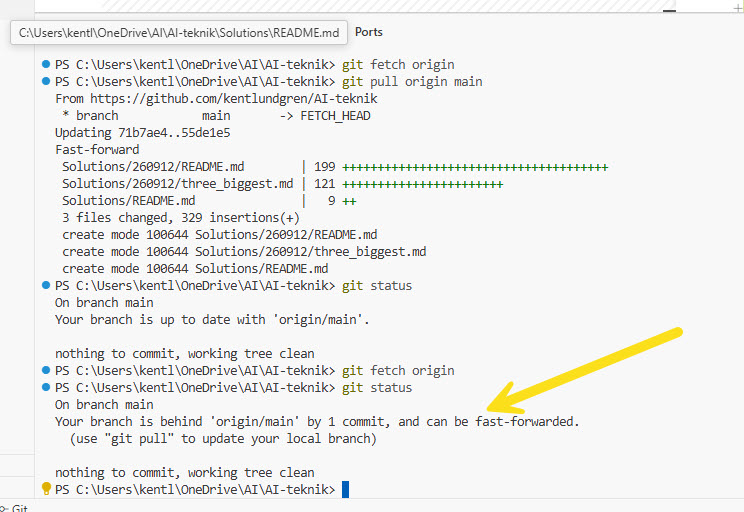

# 260912 — vad som hände, och hur filerna kommer hem till Cursor

**Datum:** 2026-09-12  
**Mapp:** `Solutions/260912/`  
**Relaterad fil:** [`three_biggest.md`](./three_biggest.md)  
**Arbetskopia på den här datorn:** `C:\\Users\\kentl\\OneDrive\\AI-teknik`  
**Live-sida:** https://kentlundgren.github.io/AI-teknik/Solutions/260912/

Den här README:n har tre uppgifter:

1. Dokumentera *hur* mappen och markdown-filen kom till — ett annat arbetssätt än det vanliga i det här repot.
2. Förklara hur lokala filer, Git och GitHub hänger ihop, och hur du hämtar hem det som redan ligger på GitHub.
3. Dokumentera övningen samma dag: pull, därefter fetch+status som visade *en commit efter*, och vad *working tree clean* betyder.

Projektets vanliga Git-regel står kvar: du committar och pushar själv. Se [`RAG/WORKFLOW.md`](../../RAG/WORKFLOW.md). Den 12 september är ett medvetet undantag: **först GitHub, sedan Git och arbetskopian** (“bakvänt” mot local-first).

---

## 1. Vad vi gjorde den här gången

Normalt i `AI-teknik` är flödet:

```text
lokal dator (Cursor)  →  git add / commit  →  git push  →  GitHub
```

Den 12 september vände vi på det: Grok skrev först till GitHub, därefter hämtade du hem med fetch/pull.

---

## 6. Andra varvet — fetch visade att status kan vara inaktuell

`git status` kan säga `up to date` mot en *gammal* `origin/main`. Efter `git fetch origin` syntes sanningen: en commit efter, working tree clean.



Bilden låg redan i repot som `Bilder/use_git_pull.jpg`. Den tidigare länken pekade på `git_fetch_origin_status.jpg`, som aldrig committades — därför syntes bara en bruten länk.

Nästa kommando i det läget:

```powershell
git pull origin main
```

---

## 9. Filer i den här mappen

| Fil | Roll |
| --- | --- |
| `README.md` | den här filen |
| `index.html` + `style.css` + `script.js` | [live-sida](https://kentlundgren.github.io/AI-teknik/Solutions/260912/) |
| `three_biggest.md` | de tre AI-matematikresultaten 2026 |
| `Bilder/git_pull_origin_main.jpg` | första pullen |
| `Bilder/use_git_pull.jpg` | andra varvet, fetch visar 1 commit efter |
| `Bilder/try_running_pull_first.jpg` | Cursor: pull före push |
| `Bilder/commit_message.jpg` | merge-commit i Cursor |

Överordnad översikt: [`../README.md`](../README.md). Projektöversikt: [`../../README.md`](../../README.md).

---

*Bildlänken i avsnitt 6 rättad 2026-09-12 till den fil som faktiskt finns i `Bilder/`.*
