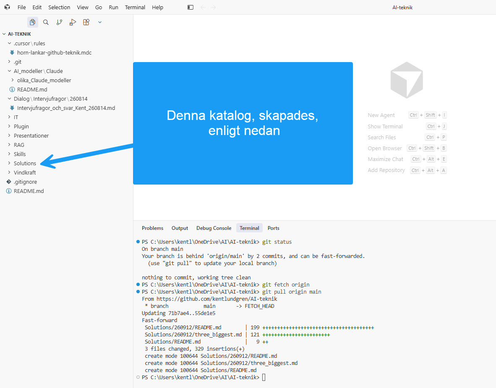

# 260912 — vad som hände, och hur filerna kommer hem till Cursor

**Datum:** 2026-09-12  
**Mapp:** `Solutions/260912/`  
**Relaterad fil:** [`three_biggest.md`](./three_biggest.md)  
**Arbetskopia på den här datorn:** `C:\Users\kentl\OneDrive\AI-teknik`

Den här README:n har tre uppgifter:

1. Dokumentera *hur* mappen och markdown-filen kom till — ett annat arbetssätt än det vanliga i det här repot.
2. Förklara hur lokala filer, Git och GitHub hänger ihop, och hur du hämtar hem det som redan ligger på GitHub.
3. Dokumentera övningen samma dag: pull, därefter fetch+status som visade *en commit efter*, och vad *working tree clean* betyder.

Projektets vanliga Git-regel står kvar: du committar och pushar själv. Se [`RAG/WORKFLOW.md`](../../RAG/WORKFLOW.md). Den 12 september är ett medvetet undantag: **först GitHub, sedan Git och arbetskopian** (“bakvänt” mot local-first).

---

## 1. Vad vi gjorde den här gången

Normalt i `AI-teknik` är flödet:

```text
lokal dator (Cursor)  →  git add / commit  →  git push  →  GitHub
```

Du skriver eller redigerar texten lokalt. Först när *du* är nöjd committar och pushar du. Cursor visar då samma träd som GitHub, plus eventuella osparade ändringar.

Den 12 september vände vi på det:

```text
Grok (via ansluten GitHub-connector)  →  commit på branch main  →  GitHub
                                                                      ↓
                         git fetch / git pull  →  lokalt Git  →  arbetskopian i Cursor
```

Grok skapade inte mappar på din Windows-dator. Grok skapade filer *direkt i fjärrrepot* `kentlundgren/AI-teknik` på GitHub. En mapp i Git är inte en tom katalog — den uppstår när minst en fil committas på den sökvägen. Därför fanns `Solutions/260912/` på GitHub så fort `three_biggest.md` lades in — men inte i Cursor-trädet förrän arbetskopian uppdaterades.

Första commiten:

- sökväg: `Solutions/260912/three_biggest.md`
- innehåll: de tre AI-matematikresultaten (Navier–Stokes / strömningar, Erdős enhetsavstånd, Jacobian-förmodan)

Den här filen (`README.md`) och [`../README.md`](../README.md) lades till i nästa commit, på samma sätt: remote-first. Därefter har README uppdaterats flera gånger på GitHub, vilket är själva övningen: varje remote-commit gör arbetskopian *ren men efter* tills du fetch:ar och pullar.

---

## 2. Tre lager — metaperspektivet

Det är lättare att välja rätt kommando om man håller isär tre saker som ofta slås ihop i vardagsspråk.

| Lager | Var det finns | Vad det är | Vad Cursor visar |
| --- | --- | --- | --- |
| **Arbetskopia** (*working tree*) | filer på disken, här `C:\Users\kentl\OneDrive\AI-teknik` | det du öppnar, redigerar och läser | Explorer-trädet till vänster |
| **Lokalt Git** | mappen `.git` i samma projekt | historik, grenar, commits som *din dator* känner till | Source Control, `git log` |
| **GitHub** | `github.com/kentlundgren/AI-teknik` | den delade fjärrkopian (`origin`) | webben, och i Cursor först *efter* fetch/pull |

Git är versionsdatabasen. GitHub är en server som håller *en* kopia av den databasen plus webbgränssnitt, Issues och Pages. Cursor är editorn som tittar på arbetskopian och pratar med det lokala Git.

`origin/main` på din dator är *inte* live-GitHub. Det är en lokal kopia av GitHub, uppdaterad bara vid `git fetch` eller `git pull`.

En fil “finns” alltså inte på ett ställe. Den kan finnas:

- bara lokalt (osparad eller untracked),
- lokalt committad men inte pushad,
- på GitHub men inte i din arbetskopia,
- på båda, men i olika versioner (divergerande historik).

När något “inte syns i Cursor” är den första frågan: *vilket lager tittar jag på?*

```text
  [din redigering]          [din commit]              [andras / Grok]
 arbetskopia  ↔— add/commit —→  lokalt Git  ↔— push/pull —→  GitHub (origin)
```

---

## 3. Två arbetsprocesser — och övningen “bakvänt”

### A. Local-first (standard i det här repot)

1. Skriv eller ändra filer i Cursor.
2. Granska diffen i Source Control.
3. Committa själv, med ett begripligt meddelande.
4. Pusha själv när du vill att GitHub ska spegla läget.

**Styrka:** du ser texten innan den blir offentlig. Du tränar Git-flödet. Du behåller kontrollen över *när* något lämnar datorn.  
**Sväghet:** en agent som bara har GitHub-access kan inte hjälpa till att lägga in filen åt dig.

Detta är medvetet. `RAG/WORKFLOW.md` Regel 1 skrevs just för att commit och push inte ska ske “av misstag” av en agent.

### B. Remote-first / bakvänt (det vi övar 12 september)

1. Texten eller ändringen landar *först* på GitHub (här: Grok via GitHub-connector).
2. GitHub är då före både lokalt Git och arbetskopian.
3. Du kör `git fetch origin` så att den lokala bilden av GitHub uppdateras.
4. `git status` visar då om du ligger efter.
5. `git pull origin main` flyttar in commiten i lokalt Git *och* skriver filerna till disken.
6. Därefter är de tre lagren i fas — tills nästa remote-commit.

Det är bakvänt mot det du är van vid, men samma tre lager. Bara ordningen ändras.

**Styrka:** du ser konkret vad fetch gör (uppdaterar kunskapen om GitHub) och vad pull gör (hämtar in kunskapen till gren + disk).  
**Sväghet:** Explorer-trädet och en `git status` *utan* färsk fetch kan se ut som att allt är ikapp, fast GitHub redan har gått vidare. Du granskar texten efter att den ligger på GitHub.

Skärmbilder och andra filer som *uppstår hos dig* läggs ändå in local-first: de finns på disken först.

---

## 4. Receptet: hämta hem en remote-first-ändring

Målet är inte att ladda ner zip från GitHub. Målet är att *uppdatera den git-klon du redan har*, så att Cursor, Git och GitHub pekar på samma commit.

Du kör PowerShell på Windows. Dela kommandona — använd inte `&&`.

### Steg 1 — stå i rätt mapp

I Cursor: Terminal → öppna en terminal i projektroten `AI-teknik`.

```powershell
Get-Location
git status
```

`Get-Location` ska visa projektroten. `git status` talar om två *olika* saker:

1. Om arbetskopian är ren eller smutsig (har du ändringar som inte är committade?).
2. Om den lokala grenen ligger före, efter eller jämsides med *den `origin/main` din dator senast hämtade*.

De två kan förekomma i alla kombinationer. Se avsnitt 7.

### Steg 2 — jämför mot live-GitHub

`git status` ensamt räcker inte mot GitHub. Först fetch, sedan status:

```powershell
git fetch origin
git status
```

- `up to date` + `working tree clean` → i fas mot GitHub *just nu*.
- `behind 'origin/main' by N commits` + `working tree clean` → tryggt att pulla.
- `ahead of 'origin/main'` → du har lokala commits som inte är pushade.

### Steg 3 — om arbetskopian är ren och du ligger efter

```powershell
git pull origin main
```

Samma sak går att göra i Cursor utan terminal: Source Control → **Sync** / **Pull**.

### Steg 4 — om arbetskopian inte är ren

Pull kan då vägra, eller ge konflikt. Välj *en* linje:

**A. Ändringarna ska behållas och committas först (oftast rätt i det här projektet)**

1. Granska diffen i Source Control.
2. Committa själv.
3. Därefter `git pull origin main`.

**B. Ändringarna är tillfälliga och ska inte committas än**

```powershell
git stash push -m "innan pull av Solutions"
git pull origin main
git stash pop
```

**C. Ändringarna ska slängas** — bara om du är säker.

Ladda inte ner en ZIP från GitHub och packa upp den ovanpå klonen.

### Steg 5 — kontroll

```powershell
git fetch origin
git status
```

Förväntat viloläge: `up to date with 'origin/main'` och `working tree clean`.

---

## 5. Första pullen — mappen blev synlig

Först visade `git status`:

```text
On branch main
Your branch is behind 'origin/main' by 2 commits, and can be fast-forwarded.
nothing to commit, working tree clean
```

Sedan:

```powershell
git fetch origin
git pull origin main
```

Git svarade med en *fast-forward* från `71b7ae4` till `55de1e5` och skapade tre filer i arbetskopian:

- `Solutions/260912/README.md`
- `Solutions/260912/three_biggest.md`
- `Solutions/README.md`

Explorer visade därefter `Solutions` mellan `Skills` och `Vindkraft`. Pullen skrev filerna till disken utifrån commits som redan fanns på GitHub. Då blev mappen synlig.

*Fast-forward* betyder: din lokala `main` pekade på en äldre commit på samma linje som `origin/main`. Git behövde inte fläta ihop två historiker. Den flyttade bara grenpekaren framåt.



Efter den pullen sade `git status` `up to date with 'origin/main'` och `working tree clean`. Det stämde *då* — mot den `origin/main` som just hämtats.

---

## 6. Andra varvet — fetch visade att status kan vara inaktuell

Lite senare kördes först `git status` (fortfarande `up to date`). Sedan, efter en ny remote-commit på GitHub:

```powershell
git fetch origin
git status
```

Då blev svaret:

```text
On branch main
Your branch is behind 'origin/main' by 1 commit, and can be fast-forwarded.
nothing to commit, working tree clean
```

Det är lektionen i en bild:

- arbetskopian var fortfarande **ren** (ingen osparad redigering),
- men den lokala grenen var **en commit efter** GitHub,
- och det syntes **först efter** `git fetch origin`.

Den saknade commiten var README-uppdateringen som Grok lagt på GitHub efter din första pull. `git status` *utan* ny fetch jämförde mot en gammal `origin/main` och sade därför `up to date`.


Nästa kommando i det läget är samma som förut:

```powershell
git pull origin main
```

Sedan `git fetch origin` och `git status` igen. Loopen är avsiktlig när man arbetar bakvänt: varje gång något landar på GitHub först blir arbetskopian åter *ren men efter* tills du fetch:ar och pullar.

Om den andra jpg-filen ännu bara finns lokalt: lägg den som `Solutions/260912/Bilder/git_fetch_origin_status.jpg` och committa den själv (local-first). Den första bilden, `git_pull_origin_main.jpg`, fanns redan i `Bilder/` på GitHub.

---

## 7. Vad “working tree clean” betyder

**Arbetskopian** (*working tree*) är själva filerna på disken i projektmappen — det Explorer visar. Den jämförs med den commit som din nuvarande gren pekar på (*HEAD*).

### När den är ren

`nothing to commit, working tree clean` betyder:

- inga *spårade* filer är ändrade jämfört med HEAD,
- ingenting ligger i *staging*,
- det finns inga ospårade nya filer som Git skulle nämna som `Untracked files`.

Kort: disken och den senaste lokala commiten är lika.

Det säger **inte** att du är ikapp GitHub. Det är en annan rad. Båda raderna förekom tillsammans två gånger den 12 september:

| Rad i `git status` | Första gången | Andra gången (efter fetch) |
| --- | --- | --- |
| `working tree clean` | inget lokalt utkast | fortfarande inget lokalt utkast |
| `behind 'origin/main'` | 2 commits | 1 commit |

Renhet handlar om *osparade ändringar*. Efter/före handlar om *vilken commit grenen pekar på jämfört med senast hämtade origin/main*.

### När den inte är ren

Arbetskopian slutar vara ren så fort disken skiljer sig från HEAD.

| Situation | Vad Git typiskt visar | Exempel i det här projektet |
| --- | --- | --- |
| Du har ändrat en spårad fil | `modified: ...` | du rättar en mening i `three_biggest.md` |
| Du har skapat en ny fil | `Untracked files` | en ny jpg i `Bilder/` innan `git add` |
| Du har tagit bort en spårad fil | `deleted: ...` | du tar bort en gammal README |
| Du har köat ändringar med `git add` | `Changes to be committed` | klar för commit, inte historik än |

Tumregel:

- **Ren** = inget ogjort arbete på disken. Tryggt att pulla.
- **Smutsig** = ett pågående utkast. Committa, stash:a eller släng — sedan pull.

En arbetskopia kan vara:

- ren och ikapp GitHub (viloläge),
- ren men efter GitHub (bakvänt flöde, före pull),
- smutsig och ikapp GitHub (local-first medan du skriver),
- smutsig och efter GitHub (stash eller committa först).

---

## 8. Hur du bör arbeta framåt

1. **Local-first är standard** när du själv formar text och bilder.
2. **Remote-first / bakvänt** när du medvetet låter en agent skriva till GitHub. Då är loopen: fetch → status → pull → fetch+status igen.
3. **Lita inte på `git status` mot GitHub utan en färsk fetch.** Det var just det andra varvet visade.
4. **En sanning per fil.** Chatten, GitHub och disken ska inte ha tre olika versioner utan att du vet vilken som gäller.
5. **Commit är en avsikt, inte en backup.**

Det pedagogiska värdet är inte mappen `Solutions`. Det är att båda riktningarna nu är sedda i terminalen:

- utåt: arbetskopia → Git → GitHub,
- inåt: GitHub → fetch (uppdatera kunskapen) → pull (uppdatera gren och disk).

---

## 9. Filer i den här mappen

| Fil | Roll |
| --- | --- |
| `README.md` | den här filen — tillkomst, bakvänt flöde, fetch/pull, working tree |
| `three_biggest.md` | de tre AI-matematikresultaten 2026, med källor |
| `Bilder/git_pull_origin_main.jpg` | första pullen, `Solutions` syns, fast-forward två commits |
| `Bilder/git_fetch_origin_status.jpg` | andra varvet: fetch visar 1 commit efter, working tree clean |

Överordnad översikt: [`../README.md`](../README.md). Projektöversikt: [`../../README.md`](../../README.md).

---

*Första versionen skapades av Grok på GitHub 2026-09-12 (remote-first). Uppdaterad samma dag i flera varv, just för att öva kedjan GitHub → fetch → status → pull.*
